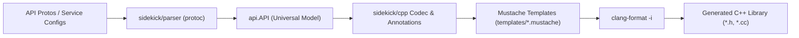

# Design Blueprint: Migrating `google-cloud-cpp` Generator to Librarian & Sidekick

## 1. Executive Summary & Objective

The objective is to replace the custom C++ generator in `google-cloud-cpp/generator` with a native Go-based generator in `librarian` and `sidekick`. The newly developed generator must produce the exact same code (100% byte-for-byte equivalence) as the existing generator, using the existing Sidekick generators for Rust (`internal/sidekick/rust`) and Swift (`internal/sidekick/swift`) as architectural templates.



---

## 2. Key Architectural Decisions Aligned

| Decision Area | Alignment | Rationale |
| :--- | :--- | :--- |
| **Milestone 1 Validation Target** | **Golden test suite first** (`generator/integration_tests/golden`) | Tests all core generator features (gRPC, REST, async, streaming, LRO, pagination, decorators, mocks, options) in a controlled environment before migrating production libraries. |
| **Generator Architecture** | **Sidekick model (`internal/sidekick/cpp`)** | Implemented in Go using Mustache templates (`templates/*.mustache`) and model enrichment passes (`annotate_*.go`), matching Rust and Swift conventions. |
| **Configuration Model** | **Native `librarian.yaml` (`cpp:`) with automated migration tool** | Adheres to Librarian standard configuration schema; provides a converter script to translate `generator_config.textproto` into `librarian.yaml`. |
| **Functional Scope Phasing** | **Phased** | **Phase 1**: C++ client code generation (`*.h`, `*.cc`) against golden files and proto APIs.<br>**Phase 2**: Scaffolding (`CMakeLists.txt`, `BUILD.bazel`, `quickstarts`).<br>**Phase 3**: Discovery document processing. |
| **Equivalence Standard** | **Exact byte-for-byte parity** | Retain identical banner comment (`// Generated by the Codegen C++ plugin.`) and copyright header. Librarian invokes `clang-format` directly on emitted files so `diff -u` against existing goldens produces zero differences. |
| **Development & Test Workflow** | **Librarian-contained first** | Protos and reference golden outputs are housed inside `librarian/internal/sidekick/cpp/testdata` so `go test` runs hermetically in Librarian CI before touching `google-cloud-cpp`. |
| **Implementation Sequencing** | **gRPC end-to-end first, then REST** | Complete all files for gRPC services (public APIs, internal stubs, decorators, mocks, sources, forwarding headers) before implementing REST transports. |
| **Tooling Dependencies** | **System `clang-format` with optional configuration** | Finds `clang-format` on `$PATH` by default, with optional path/version configuration in `librarian.yaml` under `tools:`. |
| **Annotation Model Design** | **Package-private structs with method-derived fields** | Keep annotations private (`serviceAnnotations`, etc.). Use methods for values derivable in a few lines. Use typed fields only (no `vars`/dictionaries). |
| **Test Assertion Strategy** | **Block extraction (`extractBlock`)** | Prefer `extractBlock()` over whole-file diffs or loose `strings.Contains()` in unit tests, isolating specific methods/classes for robust assertions. |
| **Source & Dependency Isolation** | **Dynamic SHA resolution, no `$HOME` paths** | Use googleapis commit SHA from C++ build files, configure via `librarian.yaml` in `testdata/`, isolate network I/O in integration tests. |
| **Review & Commit Protocol** | **Always use `review-pr` from Librarian repository** | Review every phase using the local `review-pr` skill from `.agents/skills/review-pr/SKILL.md` with the consistency prompt, then commit with a very brief comment. |

---

## 3. Component Architecture & Directory Layout

### 3.1. Librarian Configuration (`internal/config`)

Add C++ package and service definitions to `config.Library` and `config.Default`:

```go
type CppLibrary struct {
    ProductPath                        string              `yaml:"product_path,omitempty"`
    ForwardingProductPath              string              `yaml:"forwarding_product_path,omitempty"`
    ServiceEndpointEnvVar              string              `yaml:"service_endpoint_env_var,omitempty"`
    EmulatorEndpointEnvVar             string              `yaml:"emulator_endpoint_env_var,omitempty"`
    GenerateRestTransport              bool                `yaml:"generate_rest_transport,omitempty"`
    GenerateGrpcTransport              *bool               `yaml:"generate_grpc_transport,omitempty"`
    EndpointLocationStyle              string              `yaml:"endpoint_location_style,omitempty"`
    BackwardsCompatibilityNamespace    bool                `yaml:"backwards_compatibility_namespace_alias,omitempty"`
    OmittedRPCs                        []string            `yaml:"omitted_rpcs,omitempty"`
    GenAsyncRPCs                       []string            `yaml:"gen_async_rpcs,omitempty"`
    OmittedServices                    []string            `yaml:"omitted_services,omitempty"`
    RetryableStatusCodes               []string            `yaml:"retryable_status_codes,omitempty"`
    IdempotencyOverrides               []IdempotencyRule   `yaml:"idempotency_overrides,omitempty"`
    GenerateRoundRobinDecorator        bool                `yaml:"generate_round_robin_decorator,omitempty"`
    OmitClient                         bool                `yaml:"omit_client,omitempty"`
    OmitConnection                     bool                `yaml:"omit_connection,omitempty"`
    OmitStubFactory                    bool                `yaml:"omit_stub_factory,omitempty"`
    AdditionalProtoFiles               []string            `yaml:"additional_proto_files,omitempty"`
}

type IdempotencyRule struct {
    RPCName     string `yaml:"rpc_name"`
    Idempotency string `yaml:"idempotency"` // IDEMPOTENT, NON_IDEMPOTENT
}
```

### 3.2. Sidekick C++ Engine (`internal/sidekick/cpp`)

```
internal/sidekick/cpp/
├── codec.go                    # Top-level coordinator: initializes annotations and orchestrates template rendering
├── generate.go                 # File emission and template execution loop
├── annotate_service.go         # Namespaces, class names, file header guards, decorators needed
├── annotate_method.go          # Method signatures, return types (StatusOr, future, StreamRange), overloads
├── annotate_field.go           # C++ types, parameter passing (const&, move), map/repeated handling
├── annotate_comments.go        # Doxygen formatting, xref link translation, comment wrapping
├── annotate_options.go         # Option classes, option defaults, environment variables
├── generate_test.go            # Hermetic test runner verifying output against testdata/golden
├── templates/
│   ├── client.h.mustache
│   ├── client.cc.mustache
│   ├── connection.h.mustache
│   ├── connection.cc.mustache
│   ├── connection_idempotency_policy.h.mustache
│   ├── connection_idempotency_policy.cc.mustache
│   ├── options.h.mustache
│   ├── internal/
│   │   ├── auth_decorator.h.mustache
│   │   ├── auth_decorator.cc.mustache
│   │   ├── logging_decorator.h.mustache
│   │   ├── logging_decorator.cc.mustache
│   │   ├── metadata_decorator.h.mustache
│   │   ├── metadata_decorator.cc.mustache
│   │   ├── tracing_connection.h.mustache
│   │   ├── tracing_connection.cc.mustache
│   │   ├── tracing_stub.h.mustache
│   │   ├── tracing_stub.cc.mustache
│   │   ├── round_robin_decorator.h.mustache
│   │   ├── round_robin_decorator.cc.mustache
│   │   ├── stub.h.mustache
│   │   ├── stub.cc.mustache
│   │   ├── stub_factory.h.mustache
│   │   ├── stub_factory.cc.mustache
│   │   ├── connection_impl.h.mustache
│   │   ├── connection_impl.cc.mustache
│   │   ├── option_defaults.h.mustache
│   │   ├── option_defaults.cc.mustache
│   │   ├── retry_traits.h.mustache
│   │   ├── sources.cc.mustache
│   │   ├── rest_connection_impl.h.mustache
│   │   ├── rest_connection_impl.cc.mustache
│   │   ├── rest_logging_decorator.h.mustache
│   │   ├── rest_logging_decorator.cc.mustache
│   │   ├── rest_metadata_decorator.h.mustache
│   │   ├── rest_metadata_decorator.cc.mustache
│   │   ├── rest_stub.h.mustache
│   │   ├── rest_stub.cc.mustache
│   │   ├── rest_stub_factory.h.mustache
│   │   └── rest_stub_factory.cc.mustache
│   ├── mocks/
│   │   └── mock_connection.h.mustache
│   └── forwarding/
│       ├── client.h.mustache
│       ├── connection.h.mustache
│       ├── connection_idempotency_policy.h.mustache
│       ├── options.h.mustache
│       └── mock_connection.h.mustache
└── testdata/
    ├── protos/                 # test.proto, test2.proto, test_request_id.proto, test_deprecated.proto
    ├── golden/                 # Reference golden output from google-cloud-cpp
    └── golden_librarian.yaml   # Test configuration
```

### 3.3. Librarian C++ Orchestration (`internal/librarian/cpp`)

- `generate.go`: Drives the generation process for C++ libraries declared in `librarian.yaml`.
- Invokes `parser.CreateModel` (using Librarian's managed `protoc`).
- Invokes `sidekickcpp.Generate`.
- Runs `clang-format -i` across all emitted `.h` and `.cc` files.

---

## 4. Code & Testing Design Guidelines

To maintain code quality, maintainability, and architectural consistency with Librarian and Sidekick standards (such as `internal/sidekick/swift`), all C++ generator code and tests must adhere to the following rules:

### 4.1. Annotation Fields as Functions for Derived Values
- If an annotation value can be derived from another annotation field in a couple of lines, it **must be implemented as a function/method** on the struct rather than an eagerly stored field.
- Eagerly storing derived fields bloats annotation data structures and risks stale data or initialization order bugs.
- *Examples*:
  - Methods on service annotations: `ClientHeaderIncludeGuard()`, `ConnectionHeaderIncludeGuard()`, `OptionsGroupName()`, `HasExplicitOptions()`.
  - Methods on method annotations: `HasMethodSignatureOverloads()`, `IsStreaming()`.
  - Methods on field annotations: `CppType()`, `IsRepeated()`, `IsMap()`.

### 4.2. Package-Private Annotations
- All annotation types in `internal/sidekick/cpp/` must be **private to the package** by default:
  - `ServiceAnnotations` -> `serviceAnnotations`
  - `MethodAnnotations` -> `methodAnnotations`
  - `FieldAnnotations` -> `fieldAnnotations`
  - `CommentAnnotations` -> `commentAnnotations`
  - `OptionsAnnotations` -> `optionsAnnotations`
  - Any helper/nested annotation types must likewise be unexported (e.g. `endpointEnvVars`, `methodSignatureOverload`).
- If any annotation type or struct must remain exported, it must include an explicit doc comment explaining why public visibility is required.

### 4.3. Strongly-Typed Fields Only (No "vars" or Dictionaries)
- **Do not use "vars" or untyped dictionaries** (`map[string]any`, `map[string]string`) for annotations or template data contexts.
- Every value required by templates or downstream processing must have a **dedicated, strongly-typed field or method** on the annotation struct.
- This guarantees compile-time type safety, IDE discoverability, and clear template contracts.

### 4.4. Test Assertions via `extractBlock()`
- When testing generated output in unit tests, **prefer the `extractBlock()` approach** (as used throughout `internal/sidekick/swift/` tests) over full-file exact matches or loose `strings.Contains()` checks.
- `extractBlock(t *testing.T, content, startStr, endStr string) string` isolates a discrete section of the generated code (e.g., a specific method declaration, class definition, or constructor overload), which is then verified using `cmp.Diff`.
- This ensures unit tests test specific generator behaviors in isolation and remain resilient against unrelated changes (e.g., copyright year or distant comments).

### 4.5. Dynamic Googleapis Commit & Hermetic Integration Testing (No Hardcoded `$HOME` Paths)
- **Never use hardcoded paths to `$HOME`** (e.g. `/usr/local/google/home/...`) in tests or code.
- Dynamic dependency resolution:
  - Integration/pilot tests should reference the googleapis commit SHA aligned with `google-cloud-cpp` (e.g. `46403a9acec0719c130b33eb38b2ee62a45f9f6c` as declared in `google-cloud-cpp/cmake/GoogleapisConfig.cmake` and `MODULE.bazel`).
  - Use a dedicated `librarian.yaml` configuration in `testdata/` (or generated dynamically in temporary directories) to drive library generation using Librarian's native source management.
- Integration test separation:
  - Tests performing network I/O or fetching remote sources (like downloading googleapis or external repos) must be separated into integration tests (e.g. tagged with `//go:build integration` or conditional on non-short test flags) so hermetic unit tests (`go test ./...`) remain fast, deterministic, and runnable without network access or sandbox elevation.

---

## 5. Milestone 1 Implementation Roadmap

### Phase 1A: Setup & Infrastructure
1. **Config Schema**: Add `Cpp *CppLibrary` to `internal/config/config.go`.
2. **Test Fixtures**: Copy test proto definitions (`test.proto`, `test2.proto`, `test_request_id.proto`, `test_deprecated.proto`, `backup.proto`) and existing golden files into `internal/sidekick/cpp/testdata`.
3. **Golden YAML**: Create `testdata/golden_librarian.yaml` mapping the four services in `golden_config.textproto` into native Librarian configuration.
4. **Formatter Harness**: Add `Format(ctx, outDir)` using system `clang-format`.

### Phase 1B: gRPC End-to-End Generation
1. **Model Annotations (gRPC)**:
   - C++ namespace derivation and include guard formatting.
   - Types & parameters (`annotate_field.go`, `annotate_method.go`): `StatusOr<T>`, `future<StatusOr<T>>`, `StreamRange<T>`, `std::unique_ptr<AsyncStreamingReadWriteRpc<...>>`.
   - Method signature overloads (`google.api.method_signature`) with argument binding into request objects.
   - Doxygen comments and xref resolution (`annotate_comments.go`).
2. **Public API Templates**:
   - `client.h.mustache` & `client.cc.mustache`
   - `connection.h.mustache` & `connection.cc.mustache`
   - `connection_idempotency_policy.h.mustache` & `.cc`
   - `options.h.mustache`
3. **Internal gRPC Machinery**:
   - `stub.h.mustache` & `stub.cc.mustache`
   - `connection_impl.h.mustache` & `connection_impl.cc.mustache`
   - Decorators: `auth_decorator`, `logging_decorator`, `metadata_decorator`, `tracing_stub`, `tracing_connection`, `round_robin_decorator`.
   - Defaults and traits: `option_defaults`, `retry_traits`, `sources.cc`.
   - `stub_factory.h.mustache` & `stub_factory.cc.mustache`.
4. **Mocks and Forwarding Headers**:
   - `mocks/mock_connection.h.mustache`
   - Top-level forwarding headers (`forwarding_*.h.mustache`).
5. **Verification**: Verify zero diff for pure gRPC service outputs (`GoldenKitchenSink` gRPC subset, `GoldenRequestId`, `GoldenDeprecated`).

### Phase 1C: REST Transports & Mixed Services
1. **Model Annotations (REST)**:
   - HTTP path templating, query parameter extraction, HTTP method verbs.
   - Endpoint location style (`LOCATION_OPTIONALLY_DEPENDENT`, `LOCATION_DEPENDENT`).
2. **REST Templates**:
   - `rest_stub.h.mustache` & `rest_stub.cc.mustache`
   - `rest_connection_impl.h.mustache` & `rest_connection_impl.cc.mustache`
   - `rest_logging_decorator`, `rest_metadata_decorator`, `rest_stub_factory`
   - `golden_rest_only_rest_connection.h` & `.cc`
3. **Verification**: Verify zero diff on `GoldenTest2` and `GoldenThingAdmin`.

### Phase 1D: Full Golden Suite Validation
- Run comprehensive comparison against all files in `generator/integration_tests/golden`:
  ```bash
  go test -v ./internal/sidekick/cpp/... -run TestParityWithGolden
  ```
- Must achieve 100% byte-for-byte identity across all files with zero differences. (Achieved across all 188 files).

### Phase 1E: Refactor to Mustache Templates (Completed)
1. **Upstream Alignment & Developer Guidelines**:
   - Rebase changes onto `upstream/main` to integrate the latest guidelines in `internal/sidekick/GEMINI.md`.
   - Adopt `sidekick/swift` as the architectural reference: decomposed helper files, dedicated source & test files per annotation type, slim orchestrators, and granular template rendering.
2. **True Mustache Template Engine**:
   - Refactor generator from programmatic string printing (`printer.go`) to genuine Mustache templates in `internal/sidekick/cpp/templates/`.
   - Drive code generation through `language.GenerateService` or `mustache.RenderPartials` backed by `//go:embed all:templates`.
   - Templates cover all generated components: public client, public connection, idempotency policy, options, gRPC stubs & decorators, REST stubs & decorators, connection implementations, stub factories, option defaults, retry traits, mock connections, and forwarding headers.
   - Retire the interim `printer.go` string substitution helper.
3. **Strict Parity Preservation**:
   - Ensure that the refactored Mustache template rendering continues to produce 100% byte-for-byte identical output across all 188 golden files (`go test -run TestParityWithGolden`).
4. **Testing Conventions & Data Model Helpers**:
   - Always use Librarian's `api.NewTest*()` constructors (`api.NewTestAPI`, `api.NewTestService`, `api.NewTestMessage`, `api.NewTestMethod`, `api.NewTestField`, etc.) together with `api.CrossReference(model)` in `internal/sidekick/api/test.go`. Never construct raw `api.*` structs manually.
   - If new model capabilities are needed, add fluent builders to `internal/sidekick/api/test.go`.
5. **Phase Review & Commit Protocol**:
   - After completing the phase, execute the `review-pr` skill from the Librarian repository (`.agents/skills/review-pr/SKILL.md`).
   - Use the mandatory consistency prompt:
     > "Review the change for consistency. Make sure the comments for all files touched by the change match the code. Make sure the names use consistent names."
   - Address any findings, run full verification (`gofmt`, `goimports`, `golangci-lint`, `go test`), and commit locally with a very brief commit message.

---

## 6. Milestone 2 Implementation Roadmap (Phase 2 - Completed)

### Phase 2: Configuration Migration & Scaffolding (Completed)
1. **Automated Converter & CLI**:
   - Implemented zero-dependency `generator_config.textproto` parser and converter in `internal/librarian/cpp/convert_config.go`.
   - Added CLI command `librarian migrate cpp-config <path/to/generator_config.textproto> [-o output.yaml]` in `internal/librarian/migrate.go`.
2. **Scaffolding Templates & Generator**:
   - Added Mustache templates in `internal/sidekick/cpp/templates/scaffold/` for `CMakeLists.txt`, `BUILD.bazel`, `README.md`, and full `quickstart/` directory.
   - Implemented `Scaffold()` in `internal/sidekick/cpp/scaffold.go`.
   - Integrated with `librarian add` in `internal/librarian/cpp/add.go`.
3. **Production Pilot (`google/cloud/secretmanager/v1`)**:
   - Implemented pilot test in `internal/librarian/cpp/pilot_test.go` generating Secret Manager v1 from googleapis protos.
   - Achieved 100% byte-for-byte identity across all 28 C++ headers and sources against production `google-cloud-cpp`.
   - *Follow-up refactor*: Per guideline 4.5, replace hardcoded `$HOME` paths with dynamic commit resolution and a hermetic integration test driven by `testdata/librarian.yaml`.
4. **Phase Review & Commit**:
   - Reviewed according to `review-pr` skill with consistency and naming checks.
   - Tested and lint-clean (`go test`, `golangci-lint` 0 issues).

---

## 7. Phase 3: Discovery Documents, Code Modernization & Full Deprecation

### Phase 3 Scope:
1. **Apply Code Guidelines to C++ Sidekick Engine**:
   - Make annotation types private (`serviceAnnotations`, `methodAnnotations`, `fieldAnnotations`, `commentAnnotations`, `optionsAnnotations`).
   - Refactor derived annotation fields to functions/methods.
   - Eliminate any `vars` or untyped dictionaries; use strongly-typed fields only.
   - Update tests to use `extractBlock()` for focused assertions.
   - Refactor pilot tests to use dynamic googleapis SHA without hardcoded `$HOME` paths, driven by `testdata/librarian.yaml`.
2. **Discovery Documents & Compute Engine**:
   - Support nested product path namespace flattening (e.g. `compute/addresses/v1` -> `google::cloud::compute_addresses_v1`).
   - Support map-based pagination (`StreamRange<std::pair<std::string, T>>`).
   - Support Compute LRO operations (`(google.cloud.operation_service)` -> `future<StatusOr<Operation>>`).
   - Validate 100% byte-for-byte parity on `google/cloud/compute/addresses/v1`.
3. **Deprecate and Remove `google-cloud-cpp/generator`**:
   - Document replacement steps and CI workflow updates.


