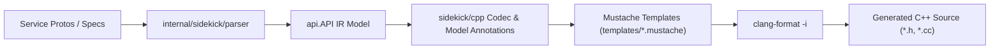

# Migration Plan: google-cloud-cpp Generator to Librarian & Sidekick

## 1. Executive Summary & Objective

This document defines the implementation roadmap for replacing `google-cloud-cpp/generator` with a native Go-based generator in `librarian` and `sidekick` (`internal/sidekick/cpp`). The goal is 100% byte-for-byte parity with existing generated C++ code, adhering to the architectural principles of `internal/sidekick/swift`.

---

## 2. Core Architectural Principles & Guidelines

| Guideline | Standard | Implementation Strategy |
| :--- | :--- | :--- |
| **Equivalence Standard** | Exact byte-for-byte parity | Retain exact banner (`// Generated by the Codegen C++ plugin.`) and copyright header. Format emitted files via system `clang-format` so `diff -u` against reference files produces zero differences. Note: Legacy golden files in `generator/integration_tests/golden/` have `DisableFormat: true` from the upstream generator (.clang-format); active formatting will be verified in production oracles (Phases 6–9) where `clang-format` is standard. |
| **Development & Test Workflow** | Librarian-contained first | Protos and reference golden outputs are housed inside `librarian/internal/sidekick/cpp/testdata` so `go test` runs hermetically in Librarian CI. |
| **Implementation Sequencing** | gRPC end-to-end first, then REST | Complete all files for gRPC services (public APIs, internal stubs, decorators, mocks, sources, forwarding headers) before implementing REST transports. |
| **Tooling Dependencies** | System `clang-format` | Resolves `clang-format` on `$PATH` by default, with optional path/version configuration in `librarian.yaml` under `tools:`. |
| **Annotation Model Design** | Package-private structs, static fields | Keep annotation structs private (`serviceAnnotations`, `methodAnnotations`, etc.). Use static typed fields only (no `vars`, maps, or dynamic dictionaries). |
| **Derived Values as Methods** | Functions over stored fields | Values derivable in 2–3 lines must be implemented as methods on annotation structs, avoiding eager storage and initialization coupling. |
| **Codec Architecture** | Swift-style config structs | Prefer typed config structs for codec options over dynamic maps (following `internal/sidekick/swift`). |
| **Test Assertion Strategy** | Block extraction (`extractBlock`) | Use `extractBlock()` in unit tests to assert structural blocks (guards, namespaces, signatures, classes) in isolation, keeping tests resilient and focused. |
| **Source & Dependency Isolation** | Dynamic SHA resolution | Use pinned googleapis commit SHA from `google-cloud-cpp`. Zero hardcoded `$HOME` paths. Isolate remote network I/O to integration tests (`//go:build integration`). |
| **Review & Commit Protocol** | `review-pr` skill with consistency check | Run `.agents/skills/review-pr/SKILL.md` with the consistency prompt after every phase, followed by linting and tests, committing with brief commit messages. |
| **Post-Phase Subagent Verification** | Architectural integrity check | Run a subagent after each phase to compare the code against this plan; stop and prompt for guidance if deviations are detected. |

---

## 3. Phased Implementation Roadmap

### Phase 1: Scaffold, Configuration & Minimal Codec
- **Goal**: Establish the C++ target in Librarian and emit a minimal `CMakeLists.txt`.
- **Tasks**:
  1. Add `LanguageCpp = "cpp"` to `internal/config/language.go`.
  2. Define `CppLibrary` and `CppDefault` in `internal/config/cpp.go`.
  3. Add `ClangFormat *ClangFormat` to `config.Tools` in `internal/config/config.go`.
  4. Add `Cpp *CppLibrary` to `config.Library` and `Cpp *CppDefault` to `config.Default`.
  5. Register C++ generation dispatch in `internal/librarian/generate.go`.
  6. Implement minimal `internal/librarian/cpp/generate.go` and `format.go`.
  7. Implement minimal `internal/sidekick/cpp/codec.go` and `generate.go` emitting an empty `CMakeLists.txt`.
  8. Add unit test in `internal/sidekick/cpp/generate_test.go` verifying `CMakeLists.txt` emission.
- **Verification**: `go test ./...`, `golangci-lint`, subagent audit against plan.

### Phase 2: Golden Oracle Fixture Setup
- **Goal**: Import test fixtures and reference golden files into Librarian for hermetic testing.
- **Tasks**:
  1. Copy test protos (`test.proto`, `test2.proto`, `test_request_id.proto`, `test_deprecated.proto`, `backup.proto`, `common.proto`) and service YAMLs from `google-cloud-cpp/main/generator/integration_tests/` into `internal/sidekick/cpp/testdata/protos/`.
  2. Copy golden reference files (188 files) from `google-cloud-cpp/main/generator/integration_tests/golden` into `internal/sidekick/cpp/testdata/golden/`.
  3. Create `internal/sidekick/cpp/testdata/golden_librarian.yaml` mapping the four test services to Librarian configuration.
  4. Implement test harness in `internal/sidekick/cpp/` capable of parsing test protos into `api.API`.
- **Verification**: Protobuf parsing succeeds hermetically in test; subagent audit against plan.

### Phase 3: Layered Emission — gRPC End-to-End
- **Goal**: Build out complete gRPC generation in distinct structural layers to achieve byte-for-byte parity on pure gRPC services (`GoldenRequestId`, pure gRPC subset of `GoldenKitchenSink`, `GoldenDeprecated`).
- **Layers**:
  - **Layer 3.1: Empty Shells**: Emit empty file shells for all gRPC and common files (client, connection, idempotency policy, options, stubs, decorators, mocks, forwarding headers, sources.cc). Assert that all 188 expected file paths are created.
  - **Layer 3.2: #includes & #ifdef Guards**: Emit copyright header, Codegen C++ banner, `#ifndef ... #define ... #endif` header guards, and `#include` directives. Assert via `extractBlock()`.
  - **Layer 3.3: Namespaces**: Emit namespace opening/closing blocks (`google::cloud::<service>_v1`, `google::cloud::<service>_v1_internal`, `google::cloud::<service>_v1_mocks`). Assert via `extractBlock()`.
  - **Layer 3.4: Class Skeletons**: Emit class definitions, inheritance hierarchies, and access specifiers (`public`, `protected`, `private`). Assert via `extractBlock()`.
  - **Layer 3.5: Function Declarations (.h)**: Emit complete method signatures for unary, paging, LRO, and streaming RPCs, including method signature overloads and Doxygen comments. Assert via `extractBlock()`.
  - **Layer 3.6: Function Definitions (.cc)**: Emit method implementations, delegation to stubs/connections, options handling, and request forwarding. Assert via `extractBlock()`.
  - **Layer 3.7: Formatting & Parity**: Run `clang-format` on emitted files and assert zero diff against golden files for pure gRPC services. Legacy golden files in `generator/integration_tests/golden/` have `DisableFormat: true` from the upstream generator (matching `generator/integration_tests/golden/.clang-format`). Active formatting will be verified in production oracles (Phases 6–9) where `clang-format` is standard.
- **Verification**: `go test ./internal/sidekick/cpp/...`, subagent audit against plan.

### Phase 4: Layered Emission — REST Transports & Mixed Services
- **Goal**: Implement REST transport generation to achieve 100% byte-for-byte parity across all 188 golden files.
- **Tasks**:
  1. Add HTTP path parsing, query parameter extraction, and URL template substitution.
  2. Implement REST templates: `rest_stub.h`, `rest_stub.cc`, `rest_connection_impl.h`, `rest_connection_impl.cc`, `rest_logging_decorator`, `rest_metadata_decorator`, `rest_stub_factory`.
  3. Validate REST-only service (`GoldenTest2` / `GoldenRestOnly`) and mixed services (`GoldenKitchenSink`, `GoldenThingAdmin`).
  4. Assert 100% byte-for-byte zero diff across all 188 files in `generator/integration_tests/golden`.
- **Verification**: `go test ./internal/sidekick/cpp/...`, subagent audit against plan.

### Phase 5: Automated Configuration Migration Tool
- **Goal**: Provide automated translation from `generator_config.textproto` to native `librarian.yaml`.
- **Tasks**:
  1. Implement textproto-to-`librarian.yaml` converter in `internal/librarian/cpp/convert_config.go`.
  2. Wire converter into `tool/cmd/migrate/main.go` under `google-cloud-cpp` (matching `dotnet`).
  3. Add unit tests in `internal/librarian/cpp/convert_config_test.go` verifying conversion of `golden_config.textproto` and production `generator_config.textproto`.
- **Verification**: Converter tests pass; subagent audit against plan.

### Phase 6: Production Oracle 2 — Secret Manager Pilot
- **Goal**: Generate `google/cloud/secretmanager/v1` from production `googleapis` protos with 100% parity.
- **Tasks**:
  1. Implement `//go:build integration` pilot test in `internal/librarian/cpp/pilot_test.go`.
  2. Use Librarian dynamic source resolver with pinned googleapis SHA (from `google-cloud-cpp`).
  3. Emit all 28 client, connection, stub, decorator, mock, and forwarding files for Secret Manager v1.
  4. Run `clang-format` and assert 100% byte-for-byte parity against production `google-cloud-cpp`.
- **Verification**: `go test -tags integration ./internal/librarian/cpp/...`, subagent audit against plan.

### Phase 7: Production Oracle 3 — Workloads (`assuredworkloads`)
- **Goal**: Support LRO operations and specialized method signatures, achieving parity on Workloads.
- **Tasks**:
  1. Validate and refine LRO polling templates and asynchronous method overloads.
  2. Run integration test generating `google/cloud/workloads/v1` (or `assuredworkloads`).
  3. Assert 100% byte-for-byte parity against production `google-cloud-cpp`.
- **Verification**: Integration test passes; subagent audit against plan.

### Phase 8: Production Oracle 4 — KMS
- **Goal**: Support IAM policy methods, location-dependent routing, and resource name helpers on KMS.
- **Tasks**:
  1. Enrich annotations for IAM policy RPCs (`GetIamPolicy`, `SetIamPolicy`, `TestIamPermissions`).
  2. Validate explicit routing headers and location-dependent endpoints.
  3. Run integration test generating `google/cloud/kms/v1`.
  4. Assert 100% byte-for-byte parity against production `google-cloud-cpp`.
- **Verification**: Integration test passes; subagent audit against plan.

### Phase 9: Production Oracle 5 — Compute Engine
- **Goal**: Support Discovery documents, non-standard LROs, and map pagination for Compute Engine.
- **Tasks**:
  1. Support Discovery document processing and REST-only GAPIC conventions.
  2. Implement flattened product path namespaces (e.g. `compute/addresses/v1` -> `google::cloud::compute_addresses_v1`).
  3. Support map-based pagination (`StreamRange<std::pair<std::string, T>>`) and Compute LROs (`(google.cloud.operation_service)`).
  4. Run integration test generating `google/cloud/compute/addresses/v1`.
  5. Assert 100% byte-for-byte parity against production `google-cloud-cpp`.
- **Verification**: Integration test passes; subagent audit against plan.
