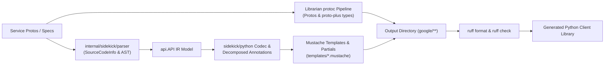

# Migration Plan: google-cloud-python Generator to Librarian & Sidekick

## 1. Executive Summary & Objective

This document defines the implementation roadmap for replacing the legacy Python generator (`google-cloud-python/packages/gapic-generator` and its post-processor) with a native Go-based generator in `librarian` and `sidekick` (`internal/sidekick/python`). The goal is 100% byte-for-byte parity with existing generated Python GAPIC client code, adhering to the architectural principles of `internal/sidekick/swift` and `internal/sidekick/GEMINI.md`.

---

## 2. Core Architectural Principles & Guidelines

| Guideline | Standard | Implementation Strategy |
| :--- | :--- | :--- |
| **Commit Directory Scoping** | Single-directory commits | Every commit must be strictly scoped to a single directory (e.g., `internal/sidekick/python`, `internal/librarian/python`, `internal/config`). If a change must cross directory boundaries (such as bootstrapping or shared parser enhancements), the agent must pause and ask for user confirmation. |
| **Equivalence Standard** | Exact byte-for-byte parity on GAPIC surface | Target 100% byte-for-byte parity on the generated GAPIC client surface (`google/**`). Retain exact banners (`# -*- coding: utf-8 -*-`, `# Generated by the protocol buffer compiler. DO NOT EDIT!`, etc.) and Apache 2.0 license headers. Parity tests against legacy goldens match unformatted goldens or active formatting as defined by upstream goldens (`ruff format`). Active formatting with `ruff` is mandatory for production oracles. |
| **Generation Scope** | GAPIC client surface | The Sidekick Python codec focuses on the GAPIC client surface: services, clients (`client.py` and `async_client.py`), transports (`grpc.py`, `grpc_asyncio.py`, `rest.py`, `rest_base.py`, `base.py`), types wrappers, pagers, `py.typed`, and `gapic_metadata.json`. Protobuf definitions and proto-plus types are generated via `protoc` orchestrated by Librarian. Full package scaffolding (`setup.py`, `docs/`) is deferred to a future phase, and unit tests for generated code are explicitly not generated. |
| **Parser & AST Fidelity** | Extend parser, zero regex re-parsing | Never re-parse `.proto` files with regex, AST disk scans, or custom tokenizers. Obtain symbol source locations (`File`, `Line`), docstrings, comments, and routing annotations directly from `internal/sidekick/parser` using `SourceCodeInfo` from `FileDescriptorSet`. Never use hardcoded symbol location tables. |
| **Template-First Emission** | Zero in-Go Python generation | Never assemble Python class definitions, method signatures, async coroutines, decorators, docstrings, or routing matchers in Go via `strings.Builder` or `fmt.Sprintf`. Mustache templates and reusable partials own all syntax, formatting, and indentation. |
| **Mustache Partials** | Modular templates & shared prologue | Use Mustache partials (`{{> prologue}}`) for shared license/banner headers across all templates. Use dedicated partials for routing matchers, method signatures, client init, and transport dispatch. |
| **Decomposed Annotations** | One file per node type | Separate annotation structs into dedicated files (`annotate_model.go`, `annotate_service.go`, `annotate_method.go`, `annotate_message.go`, `annotate_field.go`, `annotate_oneof.go`, `annotate_enum.go`, `annotate_enum_value.go`), paired 1:1 with `_test.go` files from day one. |
| **Configuration Completeness & Coexistence** | Complete merge & fill, dual-generator support | Treat `config.Library` as read-only. Add `generator: sidekick` (defaulting to legacy) to `PythonPackage` and `PythonDefault` in `internal/config/language.go`. Implement complete field merging in `mergePython` and defaults in `fillPython`. During migration, `internal/librarian/python` dispatches to Sidekick when `generator == "sidekick"` while maintaining the legacy generator path for unmigrated libraries. |
| **Orchestration Boundary** | Librarian coordinates `protoc` + Sidekick | `internal/librarian/python` orchestrates invoking `protoc` with proto and proto-plus plugins to generate pb2/pyi files into `outdir`, invokes `internal/sidekick/python` to generate the GAPIC client surface, and executes `format.go` (`ruff format`). |
| **Output Hermeticity** | Strict `outdir` containment | All generated files must stay strictly under `outdir`. Relative paths containing `..` that escape `outdir` are forbidden so `librarian clean` functions properly. |
| **Hermetic Testing & Fixtures** | In-tree golden fixtures, non-vacuous tests | Test protos and integration goldens (e.g., `credentials`, `redis`, `asset`) are copied into `internal/sidekick/python/testdata/` for hermetic testing. Dynamic googleapis SHA resolution; zero hardcoded `$HOME` paths. Unit tests use `cmp.Diff` and table-driven tests. Assert file contents, not just file existence or sizes. |
| **No Fixture Branching** | Clean production code | Never branch on test fixture names (such as `credentials` or `redis`) in production code. Production logic must be completely decoupled from fixture names. |
| **No Test Helpers in Production** | Strict separation | Never call test builders like `api.NewTestAPI` on production paths. Misconfigured libraries must fail loudly with descriptive errors. |
| **Review each commit** | Coding Quality | After each commit, spawn a subagent to review the code using the `review-pr` skill from `.agents/skills/review-pr/SKILL.md` (ignoring commit message guidelines). Address findings before proceeding. |
| **Align after each phase** | Architecture & Standards | After each phase, spawn a subagent to review the changes against the architectural guidelines in `GEMINI.md`, `internal/sidekick/python/GEMINI.md`, and this plan. If the subagent reports any deviations, ask the user how to proceed. |
| **Python Development Standards** | `internal/sidekick/python/GEMINI.md` | Establish `internal/sidekick/python/GEMINI.md` defining Python-specific development rules, formatting commands (`ruff format --check`, `ruff check`), AST annotation structures, and decomposed template organization. |
| **Worktree Topology** | Dedicated Worktree | All development occurs in the dedicated worktree: `librarian/python-migration` (branch `python-migration`). |

---

## 3. Phased Implementation Roadmap

### Phase 1: Scaffold, Complete Configuration, Formatting & Minimal Codec
- **Goal**: Establish the Python Sidekick target in Librarian with complete configuration handling, dual-generator routing, `ruff` formatting, and emit a minimal file (such as `gapic_version.py` or `py.typed`).
- **Staging & Tasks**:
  1. **`internal/config`**:
     - Add `Generator string` to `PythonPackage` and `PythonDefault` in `internal/config/language.go`.
     - Add `Ruff` tool definition schema if needed.
  2. **`internal/librarian`**:
     - Ensure `mergePython` and `fillPython` in `internal/librarian/library.go` handle `Generator` and all other fields completely without silent drops.
     - Add unit tests in `internal/librarian/library_test.go` verifying merge and default behavior.
  3. **`internal/sidekick/python`**:
     - Scaffold Python sidekick package following `new-sidekick` skill and `GEMINI.md`.
     - Create decomposed annotation files: `annotate_model.go`, `annotate_service.go`, `annotate_method.go`, `annotate_message.go`, `annotate_field.go`, `annotate_oneof.go`, `annotate_enum.go`, `annotate_enum_value.go`, paired 1:1 with `_test.go` files.
     - Implement `codec.go` and `codec_test.go`.
     - Implement `generate.go` and `generate_test.go` using embedded templates and `api.NewTestAPI`.
     - Create `templates/partials/prologue.mustache` for standard Python file license headers.
     - Create minimal template (e.g. `templates/gapic_version.py.mustache` or `templates/py.typed.mustache`).
  4. **`internal/librarian/python`**:
     - Implement `format.go` and `format_test.go` running `ruff format` and `ruff check`.
     - Wire dual-generator dispatch into `internal/librarian/python/generate.go`: when `library.Python.Generator == "sidekick"`, invoke `sidekick.Generate` and `format.go`, while preserving the legacy path for unmigrated libraries.
  5. **`internal/sidekick/python/GEMINI.md`**:
     - Author Python-specific Sidekick guidelines documenting template patterns, annotation rules, and verification commands (`ruff format --check`, `go test`, `golangci-lint`).
- **Verification**: `gofmt -s`, `goimports`, `golangci-lint` (0 issues), and unit tests pass across `internal/config`, `internal/librarian`, `internal/librarian/python`, and `internal/sidekick/python`.
- **Review Subagents**: Run `review-pr` subagent for each commit; run architectural alignment subagent at completion of Phase 1.

---

### Phase 2: Hermetic Fixtures & Test Harness
- **Goal**: Import test protos and integration goldens from `gapic-generator` into `internal/sidekick/python/testdata/` and implement a hermetic parity test harness.
- **Staging & Tasks**:
  1. **Stage 2A: Shared Parser Enhancements (`internal/sidekick/parser`, `internal/sidekick/api`)**:
     - Ensure `internal/sidekick/parser` extracts symbol comments, Python-relevant annotations, and preserves routing parameter order from `FileDescriptorSet`.
     - Run cross-language regression checks (`go test ./internal/sidekick/parser/...`, `go test ./internal/sidekick/swift/...`, `go test ./internal/sidekick/rust/...`, `go test ./internal/sidekick/cpp/...`).
  2. **Stage 2B: Hermetic Fixtures (`internal/sidekick/python/testdata`)**:
     - Copy source protos and integration goldens for canonical test cases from `google-cloud-python/packages/gapic-generator/tests/integration/goldens/`:
       - `credentials`: IAM Credentials v1 (unary RPCs, capital name edge case, LRO).
       - `redis`: Cloud Redis v1 (LRO, mixins, custom gapic config).
       - `asset`: Cloud Asset v1 (large message surface, streaming, pagination).
     - Store protos in `internal/sidekick/python/testdata/protos/` and goldens in `internal/sidekick/python/testdata/golden/`.
  3. **Stage 2C: Hermetic Test Harness**:
     - Implement test harness in `internal/sidekick/python/golden_test.go` parsing test protos into `api.API` and comparing emitted files under `google/**` against goldens.
     - Strictly forbid regex re-parsing, `proto_index.go`, hardcoded symbol tables, and fixture name branching.
- **Verification**: `go test ./internal/sidekick/python/...` and cross-language tests.
- **Review Subagents**: Run `review-pr` subagent for each commit; run architectural alignment subagent at completion of Phase 2.

---

### Phase 3: Layered Emission — Services, Clients & Transports (gRPC End-to-End)
- **Goal**: Complete gRPC generation using Mustache templates and partials, achieving byte-for-byte parity on the gRPC subset of golden services (`credentials`, `redis`).
- **Layers**:
  - **Layer 3.1: Output Paths & Package Layout**: Emit file shells and directory structure (`google/<namespace>/<name>_<version>/`) ensuring strict `outdir` containment.
  - **Layer 3.2: Markers & Versioning**: Emit `py.typed`, `gapic_version.py`, and `gapic_metadata.json` via Mustache templates. Assert via `extractBlock()`.
  - **Layer 3.3: Types Wrappers**: Emit `types/__init__.py` and `types/%proto.py` wrapping proto messages and enums. Assert via `extractBlock()`.
  - **Layer 3.4: Base Transports**: Emit `transports/base.py` and `transports/__init__.py` declaring abstract transport classes, method stubs, and credentials handling.
  - **Layer 3.5: gRPC Transports**: Emit `transports/grpc.py` and async `transports/grpc_asyncio.py` including channel initialization, method descriptors, and gRPC interceptors.
  - **Layer 3.6: Paging & Helpers**: Emit `pagers.py` supporting synchronous and asynchronous page iterators.
  - **Layer 3.7: Synchronous Client (`client.py`)**: Emit client class, initialization, client options, context managers, and method wrappers for unary, paged, streaming, and LRO methods.
  - **Layer 3.8: Asynchronous Client (`async_client.py`)**: Emit async client coroutines, async context managers, and transport wiring.
  - **Layer 3.9: gRPC Parity Check**: Assert zero diff against gRPC components of golden fixtures.
- **Verification**: Dedicated unit tests with `extractBlock` for all annotation accessors; `go test ./internal/sidekick/python/...`.
- **Review Subagents**: Run `review-pr` subagent for each commit; run architectural alignment subagent at completion of Phase 3.

---

### Phase 4: Layered Emission — REST Transports & Mixins
- **Goal**: Implement REST transport generation using Mustache templates and partials, achieving 100% byte-for-byte parity across all golden fixtures.
- **Tasks**:
  1. **HTTP Routing & Path Templates**:
     - Implement HTTP path template substitution, URL variable binding, and query parameter serialization in annotations and partials.
  2. **REST Transports**:
     - Implement `transports/rest_base.py`, `transports/rest.py`, and `transports/rest_asyncio.py` (if present).
     - Handle request serialization, response deserialization, and HTTP error mapping.
  3. **Service Mixins**:
     - Implement mixin decorators and stubs (`_mixins.py`, `_rest_mixins.py`, `_async_mixins.py`) for standard APIs (Operations, Location, IAM).
  4. **Parity Assertion**:
     - Assert 100% byte-for-byte parity across all emitted files in `credentials`, `redis`, and `asset` testdata goldens.
- **Verification**: `go test ./internal/sidekick/python/...` passes with 0 golden diffs.
- **Review Subagents**: Run `review-pr` subagent for each commit; run architectural alignment subagent at completion of Phase 4.

---

### Phase 5: Configuration Migration & Tidy
- **Goal**: Update `librarian.yaml` in `google-cloud-python` for targeted migration libraries and clean obsolete configuration options.
- **Tasks**:
  1. Update targeted library entries in `google-cloud-python/librarian.yaml` to include `generator: sidekick`.
  2. Tidy obsolete or redundant `opt_args_by_api` that are natively handled by the Sidekick generator.
  3. Verify that `librarian` loads, resolves previews, and validates the updated configuration cleanly.
- **Verification**: `go test ./internal/librarian/...` and config schema validation tests pass.
- **Review Subagents**: Run `review-pr` subagent for each commit; run architectural alignment subagent at completion of Phase 5.

---

### Phase 6: Production Oracle 1 — Secret Manager (`google-cloud-secret-manager`)
- **Goal**: Generate `google/cloud/secretmanager/v1` from production `googleapis` protos with 100% parity and active `ruff` formatting.
- **Tasks**:
  1. Implement `//go:build integration` pilot test in `internal/librarian/python/pilot_test.go`.
  2. Dynamically resolve `googleapis` commit SHA; zero hardcoded local paths.
  3. Orchestrate `protoc` generation for pb2/pyi and Sidekick generation for GAPIC client surface under `outdir`.
  4. Run active `ruff format` and `ruff check`.
  5. Assert 100% byte-for-byte parity against production `google-cloud-python/packages/google-cloud-secret-manager`.
  6. Assert non-vacuous content checks (verify method names, docstrings, imports).
- **Verification**: `go test -tags integration ./internal/librarian/python/...`.
- **Review Subagents**: Run `review-pr` subagent for each commit; run architectural alignment subagent at completion of Phase 6.

---

### Phase 7: Production Oracle 2 — Workflows (`google-cloud-workflows`)
- **Goal**: Support LRO operations, asynchronous polling, and standard mixins on Workflows with active formatting.
- **Tasks**:
  1. Validate and refine LRO polling templates and async coroutines on `google/cloud/workflows/v1`.
  2. Verify Operations mixin dispatch for long-running workflows execution.
  3. Run integration test generating `google/cloud/workflows/v1`.
  4. Run active `ruff format` and assert 100% byte-for-byte parity against production `google-cloud-python/packages/google-cloud-workflows`.
- **Verification**: `go test -tags integration ./internal/librarian/python/...`.
- **Review Subagents**: Run `review-pr` subagent for each commit; run architectural alignment subagent at completion of Phase 7.

---

### Phase 8: Production Oracle 3 — KMS (`google-cloud-kms`)
- **Goal**: Support IAM policy methods, location-dependent routing, and resource name helpers on KMS with active formatting.
- **Tasks**:
  1. Enrich annotations for IAM policy RPCs (`GetIamPolicy`, `SetIamPolicy`, `TestIamPermissions`).
  2. Validate explicit routing headers and location-dependent endpoints via routing partials.
  3. Run integration test generating `google/cloud/kms/v1`.
  4. Run active `ruff format` and assert 100% byte-for-byte parity against production `google-cloud-python/packages/google-cloud-kms`.
- **Verification**: `go test -tags integration ./internal/librarian/python/...`.
- **Review Subagents**: Run `review-pr` subagent for each commit; run architectural alignment subagent at completion of Phase 8.

---

### Phase 9: Production Oracle 4 — Compute Engine (`google-cloud-compute`)
- **Goal**: Support Discovery documents / REST-only GAPIC conventions, Compute LROs, and map-based pagination with active formatting.
- **Tasks**:
  1. Support Discovery document processing and REST-only GAPIC conventions for Python.
  2. Support flattened product path namespaces and Compute LRO polling.
  3. Support map-based pagination and specialized query encoding.
  4. Run integration test generating `google/cloud/compute/v1`.
  5. Run active `ruff format` and assert 100% byte-for-byte parity against production `google-cloud-python/packages/google-cloud-compute`.
- **Verification**: `go test -tags integration ./internal/librarian/python/...`.
- **Review Subagents**: Run `review-pr` subagent for each commit; run architectural alignment subagent at completion of Phase 9.

---

## 4. Future Roadmap Note: Full Package Surface Codec

As a future extension beyond this migration plan:
- A dedicated package surface codec will be designed to generate repository-level packaging and documentation files (`setup.py`, `pyproject.toml`, `noxfile.py`, Sphinx `docs/`, `MANIFEST.in`, etc.).
- Unit test skeletons (`tests/unit/gapic/`) will **explicitly not be generated** by Sidekick for generated code.
