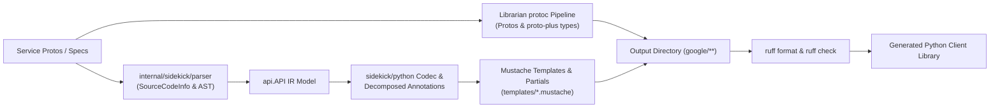

# Migration Plan: google-cloud-python Generator to Librarian & Sidekick

## 1. Executive Summary & Objective

This document defines the implementation roadmap for replacing the legacy Python generator (`google-cloud-python/packages/gapic-generator` and its post-processor) with a native Go-based generator in `librarian` and `sidekick` (`internal/sidekick/python`). The goal is 100% byte-for-byte parity with existing generated Python GAPIC client code, adhering to the architectural principles of `internal/sidekick/swift` and `internal/sidekick/GEMINI.md`.

---

## 2. Core Architectural Principles & Guidelines

| Guideline | Standard | Implementation Strategy |
| :--- | :--- | :--- |
| **Commit After Each Step** | Immediate per-step commits | Every step, stage, or layer within a phase **MUST** be committed immediately upon completion and verification. Never accumulate uncommitted changes across multiple steps or multiple directories. Each commit represents a discrete, independently verified step. |
| **Commit Directory Scoping** | Single-directory commits | Every commit must be strictly scoped to a single directory (e.g., `internal/sidekick/python`, `internal/librarian/python`, `internal/config`). If a change must cross directory boundaries (such as bootstrapping or shared parser enhancements), the agent must pause and ask for user confirmation. |
| **Review Each Commit** | Coding Quality | After each step's commit, spawn a subagent to review the code using the `review-pr` skill from `.agents/skills/review-pr/SKILL.md` (ignoring commit message guidelines). Address findings before proceeding to the next step. |
| **Align After Each Phase** | Architecture & Standards | After each phase, spawn a subagent to review the changes against the architectural guidelines in `GEMINI.md`, `internal/sidekick/python/GEMINI.md`, and this plan. If the subagent reports any deviations, ask the user how to proceed. |
| **Equivalence Standard** | Exact byte-for-byte parity on GAPIC surface | Target 100% byte-for-byte parity on the generated GAPIC client surface (`google/**`). Retain exact banners (`# -*- coding: utf-8 -*-`, `# Generated by the protocol buffer compiler. DO NOT EDIT!`, etc.) and Apache 2.0 license headers. Parity tests against legacy goldens match unformatted goldens or active formatting as defined by upstream goldens (`ruff format`). Active formatting with `ruff` is mandatory for production oracles. |
| **Generation Scope** | GAPIC client surface | The Sidekick Python codec focuses on the GAPIC client surface: services, clients (`client.py` and `async_client.py`), transports (`grpc.py`, `grpc_asyncio.py`, `rest.py`, `rest_base.py`, `base.py`), types wrappers, pagers, `py.typed`, and `gapic_metadata.json`. Protobuf definitions and proto-plus types are generated via `protoc` orchestrated by Librarian. Full package scaffolding (`setup.py`, `docs/`) is deferred to a future phase, and unit tests for generated code are explicitly not generated. |
| **Parser & AST Fidelity** | Extend parser, zero regex re-parsing | Never re-parse `.proto` files with regex, AST disk scans, or custom tokenizers. Obtain symbol source locations (`File`, `Line`), docstrings, comments, and routing annotations directly from `internal/sidekick/parser` using `SourceCodeInfo` from `FileDescriptorSet`. Never use hardcoded symbol location tables. |
| **Template-First Emission** | Zero in-Go Python generation | Never assemble Python class definitions, method signatures, async coroutines, decorators, docstrings, or routing matchers in Go via `strings.Builder` or `fmt.Sprintf`. Mustache templates and reusable partials own all syntax, formatting, and indentation. |
| **Mustache Partials** | Modular templates & shared prologue | Use Mustache partials (`{{> prologue}}`) for shared license/banner headers across all templates. Use dedicated partials for routing matchers, method signatures, client init, and transport dispatch. |
| **Decomposed Annotations** | One file per node type | Separate annotation structs into dedicated files (`annotate_model.go`, `annotate_service.go`, `annotate_method.go`, `annotate_message.go`, `annotate_field.go`, `annotate_oneof.go`, `annotate_enum.go`, `annotate_enum_value.go`), paired 1:1 with `_test.go` files from day one. |
| **Configuration Completeness & Coexistence** | Complete merge & fill, dual-generator support | Treat `config.Library` as read-only. Add `generator: sidekick` (defaulting to legacy) to `PythonPackage` and `PythonDefault` in `internal/config/language.go`. Implement complete field merging in `mergePython` and defaults in `fillPython`. During migration, `internal/librarian/python` dispatches to Sidekick when `generator == "sidekick"` while maintaining the legacy generator path for unmigrated libraries. |
| **Orchestration Boundary** | Librarian coordinates `protoc` + Sidekick | `internal/librarian/python` orchestrates invoking `protoc` with proto and proto-plus plugins to generate pb2/pyi files into `outdir`, invokes `internal/sidekick/python` to generate the GAPIC client surface, and executes `format.go` (`ruff format`). |
| **Output Hermeticity** | Strict `outdir` containment | All generated files must stay strictly under `outdir`. Relative paths containing `..` that escape `outdir` are forbidden so `librarian clean` functions properly. |
| **Hermetic Testing & Fixtures** | In-tree golden fixtures, non-vacuous tests | Test protos and integration goldens (e.g., `credentials`, `redis`, `asset`) are copied into `internal/sidekick/python/testdata/` for hermetic testing. Dynamic googleapis SHA resolution; zero hardcoded `$HOME` paths. Unit tests use `cmp.Diff` and table-driven tests. Assert file contents, not just file existence or sizes. |
| **No Fixture Branching** | Clean production code | Never branch on test fixture names (such as `credentials` or `redis`) in production code. Production logic must be completely decoupled from fixture names. |
| **No Test Helpers in Production** | Strict separation | Never call test builders like `api.NewTestAPI` on production paths. Misconfigured libraries must fail loudly with descriptive errors. |
| **Python Development Standards** | `internal/sidekick/python/GEMINI.md` | Establish `internal/sidekick/python/GEMINI.md` defining Python-specific development rules, formatting commands (`ruff format --check`, `ruff check`), AST annotation structures, and decomposed template organization. |
| **Worktree Topology** | Dedicated Worktree | All development occurs in the dedicated worktree: `librarian/python-migration` (branch `python-migration`). |

---

## 3. Phased Implementation Roadmap

### Phase 1: Scaffold, Complete Configuration, Formatting & Minimal Codec [COMPLETED]
- **Goal**: Establish the Python Sidekick target in Librarian with complete configuration handling, dual-generator routing, `ruff` formatting, and emit a minimal file (`gapic_version.py`, `py.typed`, `_compat.py`, `gapic_metadata.json`).
- **Status**: Completed, tested, and committed in discrete single-directory commits.
- **Delivered Commits**:
  - `044a5256` `feat(internal/config)`: Added `Generator` field to `PythonPackage` and `PythonDefault` with unit tests.
  - `84f850fd` `feat(internal/librarian)`: Implemented complete merge in `mergePython`, defaults in `fillPython`, and preview resolution in `resolvePreview`.
  - `80a71be7` `feat(internal/sidekick/python)`: Scaffolded Python Sidekick codec, full 8-node decomposed annotators, templates, and baseline golden parity tests across `credentials`, `redis`, and `asset`.
  - `88d52fd4` `feat(internal/librarian/python)`: Added `format.go` wrapping `ruff format`, unit tests, and dual-generator dispatch in `generate.go`.
- **Verification**: `gofmt -s`, `goimports`, `golangci-lint` (0 issues), and unit tests pass across all touched packages.

---

### Phase 2: Hermetic Fixtures & Test Harness
- **Goal**: Augment the shared parser if needed, import complete test protos and integration goldens, and establish the hermetic golden parity test harness.
- **Staging & Commits (Commit After Each Step)**:
  - **Step 2.1: Shared Parser Enhancements (`internal/sidekick/parser`, `internal/sidekick/api`)**:
    1. Ensure `internal/sidekick/parser` extracts symbol comments, Python-relevant docstrings, and preserves routing parameter order from `FileDescriptorSet`.
    2. Run cross-language regression checks (`go test ./internal/sidekick/parser/...`, `go test ./internal/sidekick/swift/...`, `go test ./internal/sidekick/rust/...`, `go test ./internal/sidekick/cpp/...`).
    3. **Commit**: `feat(internal/sidekick/parser): extract Python symbol docstrings and parameter order`
    4. Run `review-pr` subagent on commit.
  - **Step 2.2: Hermetic Fixtures (`internal/sidekick/python/testdata`)**:
    1. Verify all required source protos and integration goldens (`credentials`, `redis`, `asset`) are present in `internal/sidekick/python/testdata/`.
    2. Ensure protos are in `internal/sidekick/python/testdata/protos/` and goldens in `internal/sidekick/python/testdata/golden/`.
    3. **Commit**: `test(internal/sidekick/python): organize hermetic test protos and integration goldens`
    4. Run `review-pr` subagent on commit.
  - **Step 2.3: Hermetic Test Harness (`internal/sidekick/python/golden_test.go`)**:
    1. Implement comprehensive test harness in `internal/sidekick/python/golden_test.go` parsing test protos into `api.API` and asserting byte-for-byte parity on emitted files under `google/**`.
    2. Strictly forbid regex re-parsing, `proto_index.go`, hardcoded symbol tables, and fixture name branching.
    3. **Commit**: `test(internal/sidekick/python): implement hermetic golden parity test harness`
    4. Run `review-pr` subagent on commit.
  - **Phase 2 Alignment Review**:
    - Spawn architectural alignment subagent to review changes against `internal/sidekick/GEMINI.md`, `internal/sidekick/python/GEMINI.md`, and this plan. Address any findings.

---

### Phase 3: Layered Emission — Services, Clients & Transports (gRPC End-to-End)
- **Goal**: Complete gRPC generation using Mustache templates and partials, achieving byte-for-byte parity on the gRPC subset of golden services (`credentials`, `redis`).
- **Layers & Commits (Commit After Each Step)**:
  - **Step 3.1: Output Paths & Package Layout**:
    1. Emit file shells and directory structure (`google/<namespace>/<name>_<version>/`) ensuring strict `outdir` containment.
    2. **Commit**: `feat(internal/sidekick/python): emit GAPIC output package layout`
    3. Run `review-pr` subagent on commit.
  - **Step 3.2: Types Wrappers**:
    1. Emit `types/__init__.py` and `types/%proto.py` wrapping proto messages and enums via Mustache templates. Assert via `extractBlock()`.
    2. **Commit**: `feat(internal/sidekick/python): emit types package wrappers`
    3. Run `review-pr` subagent on commit.
  - **Step 3.3: Base Transports**:
    1. Emit `transports/base.py` and `transports/__init__.py` declaring abstract transport classes, method stubs, and credentials handling. Assert via `extractBlock()`.
    2. **Commit**: `feat(internal/sidekick/python): emit base transport classes and stubs`
    3. Run `review-pr` subagent on commit.
  - **Step 3.4: gRPC Transports**:
    1. Emit `transports/grpc.py` and async `transports/grpc_asyncio.py` including channel initialization, method descriptors, and gRPC interceptors. Assert via `extractBlock()`.
    2. **Commit**: `feat(internal/sidekick/python): emit gRPC and gRPC-AsyncIO transports`
    3. Run `review-pr` subagent on commit.
  - **Step 3.5: Paging & Helpers**:
    1. Emit `pagers.py` supporting synchronous and asynchronous page iterators. Assert via `extractBlock()`.
    2. **Commit**: `feat(internal/sidekick/python): emit sync and async pagers`
    3. Run `review-pr` subagent on commit.
  - **Step 3.6: Synchronous Client (`client.py`)**:
    1. Emit client class, initialization, client options, context managers, and method wrappers for unary, paged, streaming, and LRO methods. Assert via `extractBlock()`.
    2. **Commit**: `feat(internal/sidekick/python): emit synchronous service client`
    3. Run `review-pr` subagent on commit.
  - **Step 3.7: Asynchronous Client (`async_client.py`)**:
    1. Emit async client coroutines, async context managers, and transport wiring. Assert via `extractBlock()`.
    2. **Commit**: `feat(internal/sidekick/python): emit asynchronous service client`
    3. Run `review-pr` subagent on commit.
  - **Step 3.8: gRPC Parity Verification**:
    1. Assert zero diff against gRPC components of golden fixtures (`credentials`, `redis`).
    2. **Commit**: `test(internal/sidekick/python): verify gRPC client and transport golden parity`
    3. Run `review-pr` subagent on commit.
  - **Phase 3 Alignment Review**:
    - Spawn architectural alignment subagent to review changes against `internal/sidekick/GEMINI.md`, `internal/sidekick/python/GEMINI.md`, and this plan.

---

### Phase 4: Layered Emission — REST Transports & Mixins
- **Goal**: Implement REST transport generation using Mustache templates and partials, achieving 100% byte-for-byte parity across all golden fixtures.
- **Tasks & Commits (Commit After Each Step)**:
  - **Step 4.1: HTTP Routing & Path Templates**:
    1. Implement HTTP path template substitution, URL variable binding, and query parameter serialization in annotations and partials.
    2. **Commit**: `feat(internal/sidekick/python): add HTTP routing and path template annotations`
    3. Run `review-pr` subagent on commit.
  - **Step 4.2: REST Base & Synchronous Transport**:
    1. Implement `transports/rest_base.py` and `transports/rest.py`. Handle request serialization, response deserialization, and HTTP error mapping.
    2. **Commit**: `feat(internal/sidekick/python): emit REST base and synchronous transports`
    3. Run `review-pr` subagent on commit.
  - **Step 4.3: REST AsyncIO Transport**:
    1. Implement `transports/rest_asyncio.py` for asynchronous HTTP execution.
    2. **Commit**: `feat(internal/sidekick/python): emit REST async transport`
    3. Run `review-pr` subagent on commit.
  - **Step 4.4: Service Mixins**:
    1. Implement mixin decorators and stubs (`_mixins.py`, `_rest_mixins.py`, `_async_mixins.py`) for standard APIs (Operations, Location, IAM).
    2. **Commit**: `feat(internal/sidekick/python): emit service mixin stubs and decorators`
    3. Run `review-pr` subagent on commit.
  - **Step 4.5: Full Golden Parity Verification**:
    1. Assert 100% byte-for-byte parity across all emitted files in `credentials`, `redis`, and `asset` testdata goldens.
    2. **Commit**: `test(internal/sidekick/python): verify full golden parity across all fixtures`
    3. Run `review-pr` subagent on commit.
  - **Phase 4 Alignment Review**:
    - Spawn architectural alignment subagent to review changes against `internal/sidekick/GEMINI.md`, `internal/sidekick/python/GEMINI.md`, and this plan.

---

### Phase 5: Configuration Migration & Tidy
- **Goal**: Update `librarian.yaml` in `google-cloud-python` for targeted migration libraries and clean obsolete configuration options.
- **Tasks & Commits (Commit After Each Step)**:
  - **Step 5.1: Configuration Updates**:
    1. Update targeted library entries in `google-cloud-python/librarian.yaml` to include `generator: sidekick`.
    2. **Commit**: `chore(config): set generator to sidekick for pilot python libraries`
    3. Run `review-pr` subagent on commit.
  - **Step 5.2: Configuration Tidy**:
    1. Tidy obsolete or redundant `opt_args_by_api` that are natively handled by the Sidekick generator.
    2. Verify `librarian` loads, resolves previews, and validates the updated configuration cleanly.
    3. **Commit**: `chore(config): tidy obsolete opt_args_by_api for sidekick python libraries`
    4. Run `review-pr` subagent on commit.
  - **Phase 5 Alignment Review**:
    - Spawn architectural alignment subagent to review changes against `internal/sidekick/GEMINI.md` and this plan.

---

### Phase 6: Production Oracle 1 — Secret Manager (`google-cloud-secret-manager`)
- **Goal**: Generate `google/cloud/secretmanager/v1` from production `googleapis` protos with 100% parity and active `ruff` formatting.
- **Tasks & Commits (Commit After Each Step)**:
  - **Step 6.1: Integration Pilot Harness**:
    1. Implement `//go:build integration` pilot test in `internal/librarian/python/pilot_test.go`.
    2. Dynamically resolve `googleapis` commit SHA; zero hardcoded local paths.
    3. **Commit**: `test(internal/librarian/python): implement secret manager integration pilot test`
    4. Run `review-pr` subagent on commit.
  - **Step 6.2: Generation & Parity Validation**:
    1. Orchestrate `protoc` generation for pb2/pyi and Sidekick generation for GAPIC client surface under `outdir`.
    2. Run active `ruff format` and `ruff check`.
    3. Assert 100% byte-for-byte parity against production `google-cloud-python/packages/google-cloud-secret-manager`.
    4. Assert non-vacuous content checks (verify method names, docstrings, imports).
    5. **Commit**: `feat(internal/librarian/python): achieve 100% parity on secret manager v1`
    6. Run `review-pr` subagent on commit.
  - **Phase 6 Alignment Review**:
    - Spawn architectural alignment subagent.

---

### Phase 7: Production Oracle 2 — Workflows (`google-cloud-workflows`)
- **Goal**: Support LRO operations, asynchronous polling, and standard mixins on Workflows with active formatting.
- **Tasks & Commits (Commit After Each Step)**:
  - **Step 7.1: Workflows Integration Harness**:
    1. Implement `//go:build integration` test generating `google/cloud/workflows/v1`.
    2. Validate and refine LRO polling templates and async coroutines on `google/cloud/workflows/v1`.
    3. **Commit**: `test(internal/librarian/python): implement workflows integration pilot test`
    4. Run `review-pr` subagent on commit.
  - **Step 7.2: Workflows Generation & Parity Validation**:
    1. Verify Operations mixin dispatch for long-running workflows execution.
    2. Run active `ruff format` and assert 100% byte-for-byte parity against production `google-cloud-python/packages/google-cloud-workflows`.
    3. **Commit**: `feat(internal/librarian/python): achieve 100% parity on workflows v1`
    4. Run `review-pr` subagent on commit.
  - **Phase 7 Alignment Review**:
    - Spawn architectural alignment subagent.

---

### Phase 8: Production Oracle 3 — KMS (`google-cloud-kms`)
- **Goal**: Support IAM policy methods, location-dependent routing, and resource name helpers on KMS with active formatting.
- **Tasks & Commits (Commit After Each Step)**:
  - **Step 8.1: KMS Integration Harness**:
    1. Implement `//go:build integration` test generating `google/cloud/kms/v1`.
    2. Enrich annotations for IAM policy RPCs (`GetIamPolicy`, `SetIamPolicy`, `TestIamPermissions`).
    3. Validate explicit routing headers and location-dependent endpoints via routing partials.
    4. **Commit**: `test(internal/librarian/python): implement kms integration pilot test`
    5. Run `review-pr` subagent on commit.
  - **Step 8.2: KMS Generation & Parity Validation**:
    1. Run active `ruff format` and assert 100% byte-for-byte parity against production `google-cloud-python/packages/google-cloud-kms`.
    2. **Commit**: `feat(internal/librarian/python): achieve 100% parity on kms v1`
    3. Run `review-pr` subagent on commit.
  - **Phase 8 Alignment Review**:
    - Spawn architectural alignment subagent.

---

### Phase 9: Production Oracle 4 — Compute Engine (`google-cloud-compute`)
- **Goal**: Support Discovery documents / REST-only GAPIC conventions, Compute LROs, and map-based pagination with active formatting.
- **Tasks & Commits (Commit After Each Step)**:
  - **Step 9.1: Compute Integration Harness**:
    1. Support Discovery document processing and REST-only GAPIC conventions for Python.
    2. Support flattened product path namespaces and Compute LRO polling.
    3. Support map-based pagination and specialized query encoding.
    4. Implement `//go:build integration` test generating `google/cloud/compute/v1`.
    5. **Commit**: `test(internal/librarian/python): implement compute integration pilot test`
    6. Run `review-pr` subagent on commit.
  - **Step 9.2: Compute Generation & Parity Validation**:
    1. Run active `ruff format` and assert 100% byte-for-byte parity against production `google-cloud-python/packages/google-cloud-compute`.
    2. **Commit**: `feat(internal/librarian/python): achieve 100% parity on compute v1`
    3. Run `review-pr` subagent on commit.
  - **Phase 9 Alignment Review**:
    - Spawn architectural alignment subagent.

---

## 4. Future Roadmap Note: Full Package Surface Codec

As a future extension beyond this migration plan:
- A dedicated package surface codec will be designed to generate repository-level packaging and documentation files (`setup.py`, `pyproject.toml`, `noxfile.py`, Sphinx `docs/`, `MANIFEST.in`, etc.).
- Unit test skeletons (`tests/unit/gapic/`) will **explicitly not be generated** by Sidekick for generated code.
